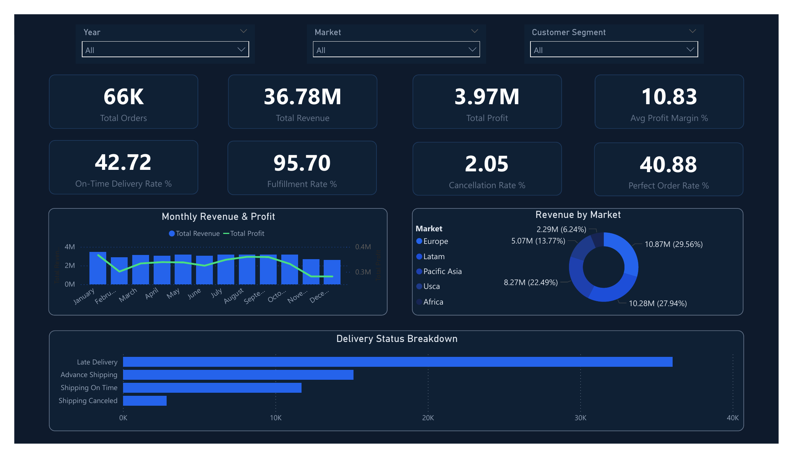
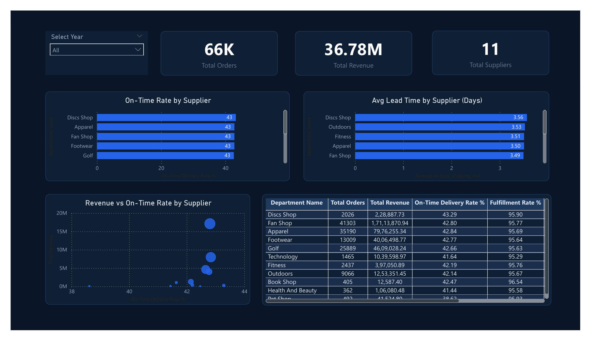
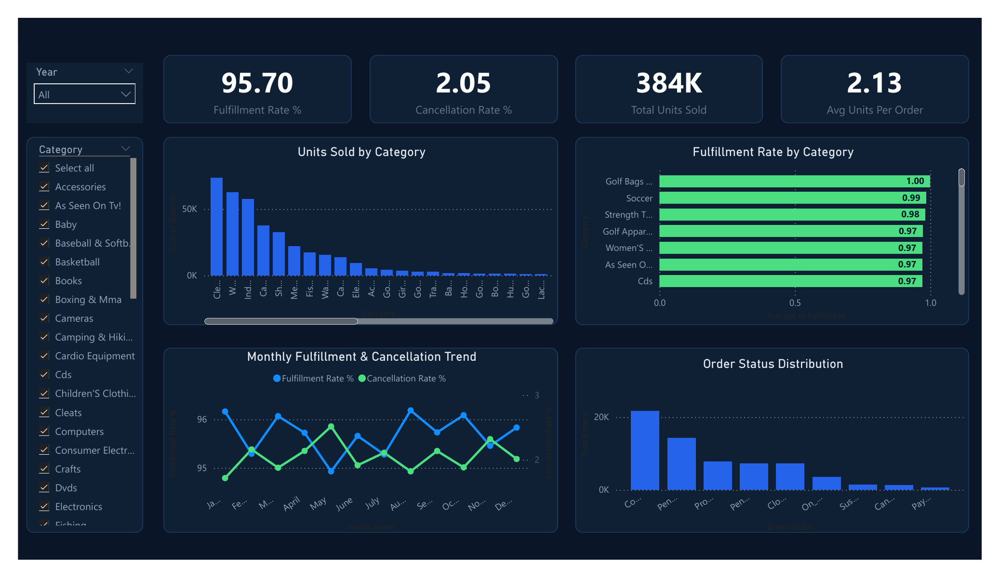
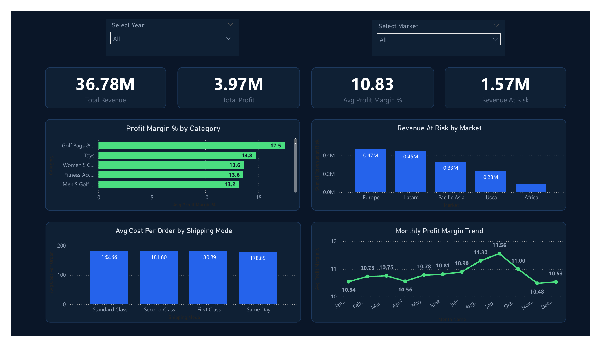
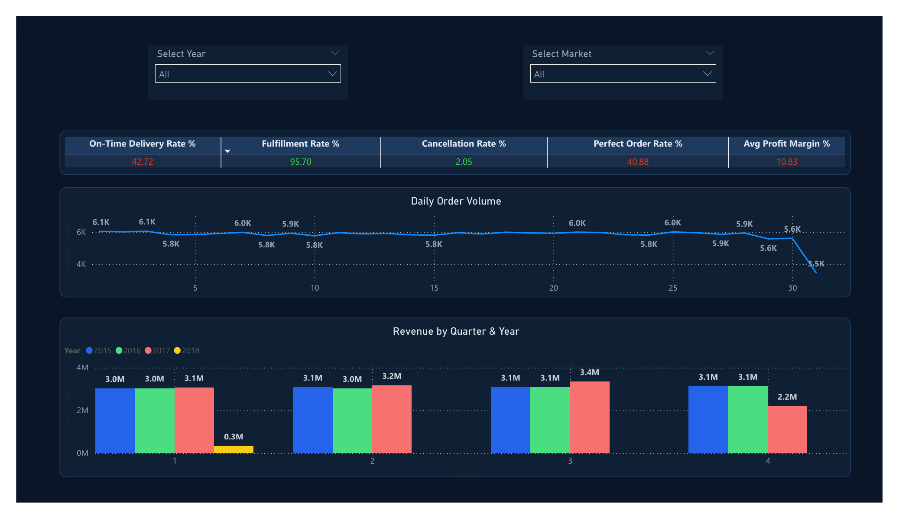

# 📦 FlowMetrics — Supply Chain KPI Monitor

A complete end-to-end supply chain analytics system built on the **DataCo Global Supply Chain dataset (~180K rows)**. The system ingests raw data, cleans and transforms it using PySpark, stores it in a structured star-schema warehouse, computes 10+ business KPIs using SQL, and visualises results in an interactive Streamlit dashboard.

---
## Dashboard and Streamlit App

[](https://flowmetrics-tn019.streamlit.app/)
[](assets/flowmetrics_dash.pdf)

### 📊 Executive Summary


### 🏭 Supplier Performance


### 📦 Inventory & Fulfillment


### 💰 Cost & Risk


### 🔄 Operations Overview



---

## 📌 Table of Contents

- [Project Overview](#project-overview)
- [Tech Stack](#tech-stack)
- [Project Structure](#project-structure)
- [Setup & Installation](#setup--installation)
- [Pipeline Phases](#pipeline-phases)
- [KPIs Computed](#kpis-computed)
- [Dashboard](#dashboard)
- [Database Schema](#database-schema)
- [Dataset](#dataset)

---

## Project Overview

| Item | Detail |
|---|---|
| **Dataset** | DataCo Global Supply Chain (Kaggle) |
| **Rows** | ~180,519 order line items |
| **Date Range** | January 2015 – January 2018 |
| **Markets** | Europe, LATAM, Pacific Asia, USCA, Africa |
| **KPIs** | 10 supply chain KPIs |
| **Dashboard** | 5-page Streamlit app with Plotly charts |

---

## Tech Stack

| Layer | Technology |
|---|---|
| Language | Python 3.11 |
| Data Processing | PySpark 3.5 (local mode) |
| Warehouse | SQLite (star schema) |
| Orchestration | Pandas, NumPy |
| Dashboard | Streamlit + Plotly |
| Version Control | Git |

---

## Project Structure

```
FlowMetrics/
│
├── data/
│   ├── raw/                          ← Original CSV from Kaggle
│   │   └── cleaned/                  ← Cleaned domain CSVs
│   └── processed/                    ← Spark-processed CSVs
│
├── etl/
│   ├── explore.py             ← Data exploration
│   ├── clean.py               ← Data cleaning
│   └── spark_transform.py     ← PySpark transformations
│
├── warehouse/
│   ├── warehouse.py           ← Star schema + SQLite loader
│   └── supply_chain.db               ← SQLite database (generated)
│
├── kpis/
│   ├── kpis.py                ← KPI computation via SQL
│   └── results/                      ← KPI CSVs (generated)
│
├── pipelines/
│   ├── pipeline_logs/           ← Log DB and log files
│   ├── powerbi_export.py        ← Export script
│   ├── scheduler.py             ← Automated daily scheduler
│   ├── view_logs.py             ← Pipeline run history viewer
|   └── daily_pipeline.py|       ← Pipeline simulation
│
├── powerbi/
|   ├── data/                       ← CSVs exported for Power BI
|   └── flowmetrics dash.pbix       ← PowerBI Dashboard
|
├── dashboard/
│   └── app.py                        ← Streamlit dashboard
│
├── assets/                           ← Contains Dashboard Preview Images
|
├── .gitignore
├── requirements.txt
└── README.md
```

---

## Setup & Installation

### 1. Prerequisites

- Python 3.11
- Java 11+ (required for PySpark)
- Git

### 2. Clone the Repository

```bash
git clone https://github.com/your-username/FlowMetrics.git
cd FlowMetrics
```

### 3. Create Virtual Environment

```bash
conda create -n sckpi python=3.11 -y
conda activate sckpi
```

### 4. Install Dependencies

```bash
pip install -r requirements.txt
```

### 5. Download the Dataset

Download the DataCo Global Supply Chain dataset from Kaggle:
👉 https://www.kaggle.com/datasets/shashwatwork/dataco-smart-supply-chain-for-big-data-analysis

Place the file at:
```
data/raw/DataCoSupplyChainDataset.csv
```

### 6. Windows-Only: PySpark Setup

If you're on Windows, add these lines to the top of `phase3_spark_transform.py`:

```python
import sys
os.environ["PYSPARK_PYTHON"]        = sys.executable
os.environ["PYSPARK_DRIVER_PYTHON"] = sys.executable
```

---

## Pipeline Phases

Run the phases in order:

### Phase 1 — Explore

```bash
python etl/explore.py
```

Loads the raw dataset, inspects column types, null counts, and unique values. Creates initial domain DataFrames for orders, customers, and products.

### Phase 2 — Clean

```bash
python etl/clean.py
```

Handles missing values, converts date columns, standardises category names, adds derived columns, and saves three clean CSVs to `data/raw/cleaned/`.

**New columns added:**

| Column | Description |
|---|---|
| `delivery_delay_days` | Actual minus scheduled shipping days |
| `on_time_flag` | 1 if delivered on time or early |
| `profit_margin_pct` | Profit / Sales × 100 |
| `is_cancelled` | 1 if order was canceled |
| `is_fulfilled` | 1 if order completed successfully |
| `revenue_at_risk` | Sales value of unfulfilled orders |
| `cost_per_order` | Proxy cost per order line |

### Phase 3 — PySpark Transform

```bash
python etl/spark_transform.py
```

Reads cleaned CSVs into Spark, recomputes all business columns, derives supplier-level metrics from department data, and produces monthly, regional, and shipping-mode rollups. Saves output to `data/processed/` as CSVs.

### Phase 4 — Data Warehouse

```bash
python warehouse/warehouse.py
```

Builds a star schema in SQLite with dimension and fact tables. Loads all processed data and verifies the schema with six SQL queries.

### Phase 5 — KPI Computation

```bash
python kpis/kpis.py
```

Runs all 10 KPI queries against the warehouse and saves individual CSV results to `kpis/results/`.

### Phase 6 — Dashboard

```bash
streamlit run dashboard/app.py
```

Launches the multi-page Streamlit dashboard at `http://localhost:8501`.

---

## KPIs Computed

| # | KPI | Description |
|---|---|---|
| 01 | On-Time Delivery Rate | % of orders delivered by scheduled date |
| 02 | Fulfillment Rate | % of orders successfully completed |
| 03 | Average Delivery Delay | Mean days late across all shipments |
| 04 | Supplier Lead Time | Avg actual shipping days by department |
| 05 | Inventory Turnover (Proxy) | Sales / Cost ratio by product category |
| 06 | Profit Margin % | Avg profit as % of sales |
| 07 | Cost Per Order | Avg fulfilment cost per order line |
| 08 | Cancelled Order Rate | % of orders cancelled + revenue lost |
| 09 | Perfect Order Rate | % on time + fulfilled + not cancelled |
| 10 | Revenue At Risk | Total sales value of unfulfilled orders |

---

## Dashboard

The Streamlit dashboard has 5 pages accessible from a **horizontal navigation bar** at the top. Sidebar filters let you slice by Year, Market, Customer Segment, and Product Category.

| Page | Contents |
|---|---|
| 📊 Executive Summary | 12 KPI cards, monthly revenue chart, market pie chart, delivery breakdown |
| 🏭 Supplier Performance | On-time rate by supplier, lead time bar chart, revenue vs on-time scatter, full table |
| 📦 Inventory & Fulfillment | Units sold by category, fulfillment rate chart, monthly trend, order status distribution |
| 💰 Cost & Risk | Profit margin by category, revenue at risk by market, cost by shipping mode, margin trend |
| 🔄 Operations Overview | Data health checks, daily order volume, day-of-week pattern, KPI health scorecard |

---

## Database Schema

```
FACT TABLE
  fact_orders         ← 180K rows, 33 columns

DIMENSION TABLES
  dim_customers       ← 20,652 unique customers
  dim_products        ← 118 unique products
  dim_suppliers       ← 22 departments (used as suppliers)
  dim_date            ← Unique order dates with year/month/quarter/week
  dim_geography       ← Unique market/region/country/city combinations

KPI ROLLUP TABLES
  kpi_monthly         ← Monthly aggregated KPIs
  kpi_regional        ← Regional aggregated KPIs
  kpi_shipping        ← Shipping mode aggregated KPIs
  supplier_metrics    ← Supplier-level performance metrics
```

---

## Dataset

**DataCo Smart Supply Chain for Big Data Analysis**
- Source: Kaggle
- Link: https://www.kaggle.com/datasets/shashwatwork/dataco-smart-supply-chain-for-big-data-analysis
- Rows: 180,519
- Columns: 53
- Encoding: latin-1

> The raw dataset file is excluded from this repository via `.gitignore` due to its size (~72MB). Download it separately and place it at `data/raw/DataCoSupplyChainDataset.csv`.

---

## Requirements

```
pandas==2.1.4
numpy==1.26.2
pyspark==3.5.0
streamlit==1.29.0
plotly==5.18.0
sqlalchemy==2.0.23
pyarrow==14.0.1
openpyxl==3.1.2
python-dotenv==1.0.0
```

---

*Built with Python, PySpark, SQLite, and Streamlit.*